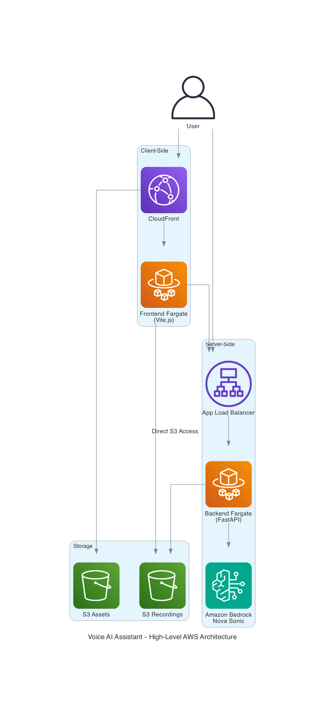
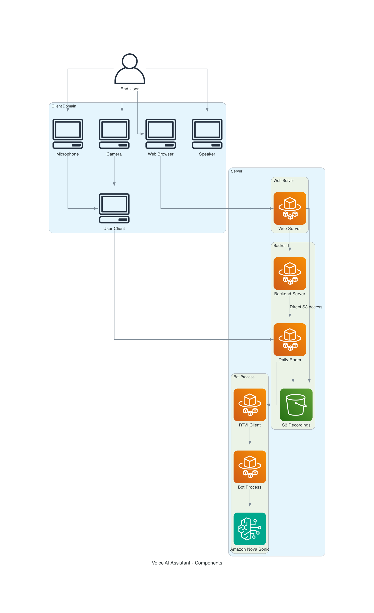
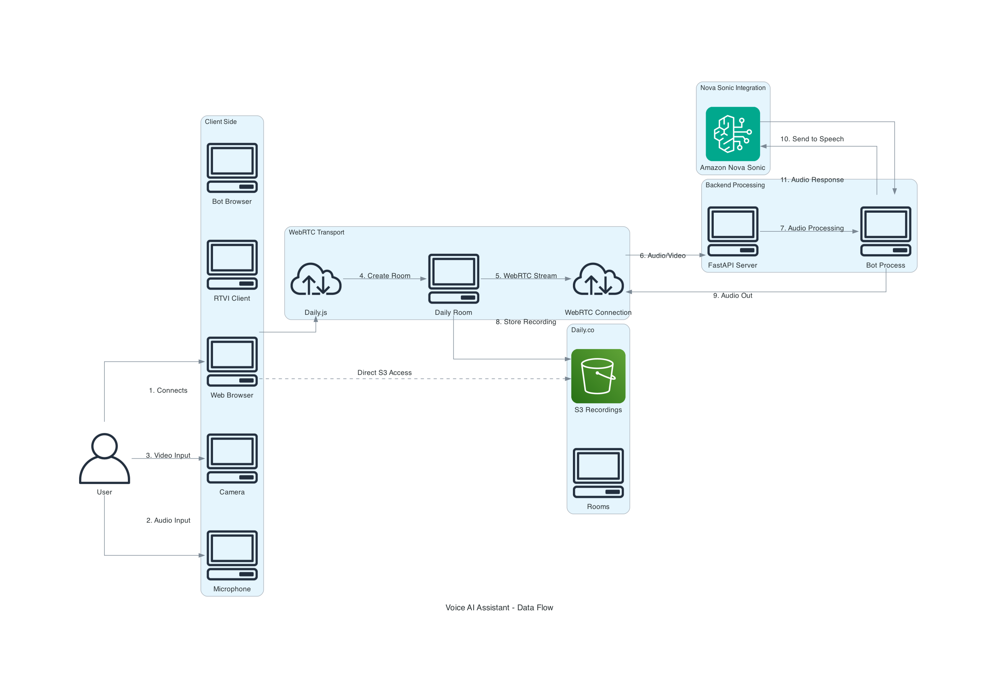

# Voice AI Assistant

A secure, enterprise-grade voice assistant solution powered by Amazon Nova Sonic, with WebRTC connectivity through Daily, and fully hosted on AWS infrastructure.

## Table of Contents

- [Voice AI Assistant](#voice-ai-assistant)
  - [Table of Contents](#table-of-contents)
  - [Overview](#overview)
    - [Key Features](#key-features)
  - [Architecture](#architecture)
    - [Architecture Diagrams](#architecture-diagrams)
    - [Backend (Server)](#backend-server)
    - [Frontend (Client)](#frontend-client)
    - [AWS Infrastructure](#aws-infrastructure)
  - [Security Features](#security-features)
    - [Data Security](#data-security)
    - [Access Control](#access-control)
    - [Network Security](#network-security)
    - [Compliance](#compliance)
  - [Recording Management](#recording-management)
  - [Backend Architecture](#backend-architecture)
    - [Server Component (`server.py`)](#server-component-serverpy)
    - [Bot Component (`bot_bedrock_nova.py`)](#bot-component-bot_bedrock_novapy)
    - [Amazon Nova Sonic Integration](#amazon-nova-sonic-integration)
    - [WebRTC Connection via Daily Transport](#webrtc-connection-via-daily-transport)
    - [Recording Management System](#recording-management-system)
    - [Transcript Handling (`transcript_handler.py`)](#transcript-handling-transcript_handlerpy)
    - [API Functions (`function_schema.py`)](#api-functions-function_schemapy)
  - [Frontend Architecture](#frontend-architecture)
    - [Core Frontend Components](#core-frontend-components)
      - [Client Architecture (`app.js`)](#client-architecture-appjs)
      - [Video Management (`VideoManager.js`)](#video-management-videomanagerjs)
      - [Camera Toggle (`CameraToggle.js`)](#camera-toggle-cameratogglejs)
    - [Frontend-Backend Integration](#frontend-backend-integration)
    - [User Interface Components](#user-interface-components)
    - [WebRTC Implementation Details](#webrtc-implementation-details)
    - [Configuration and Deployment](#configuration-and-deployment)
  - [Deployment](#deployment)
    - [Prerequisites](#prerequisites)
    - [Environment Setup](#environment-setup)
    - [AWS Infrastructure Deployment](#aws-infrastructure-deployment)
    - [Backend Deployment](#backend-deployment)
    - [Frontend Deployment](#frontend-deployment)
    - [Setting up S3 Buckets for Daily Recordings](#setting-up-s3-buckets-for-daily-recordings)
    - [Configuration for Amazon Nova Sonic](#configuration-for-amazon-nova-sonic)
    - [Testing and Verification](#testing-and-verification)

## Overview

The Voice AI Assistant is a comprehensive speech-to-speech conversational AI system designed specifically for enterprise environments. It leverages cutting-edge technologies to provide a secure, scalable, and feature-rich voice interaction experience.

### Key Features

- **Amazon Nova Sonic Integration**: Utilizes Amazon's advanced large language model for natural, contextual conversations
- **Real-time Communication**: WebRTC connectivity through Daily's transport layer enables high-quality, low-latency audio streaming
- **Enterprise Security**: All data remains within your AWS environment, with no third-party data processing
- **Secure Recording Storage**: Voice recordings stored in designated S3 buckets with comprehensive access controls
- **Containerized Deployment**: Fully containerized solution for consistent deployment across environments
- **Scalable Infrastructure**: AWS-native architecture designed to scale with your organization's needs

## Architecture

The Voice AI Assistant is built on a modern, distributed architecture that enables real-time bidirectional voice communication between users and an AI assistant. The system consists of three main components:

### Architecture Diagrams

This project includes the following diagrams to help understand the system architecture:

1. **High-Level AWS Architecture**: Shows the overall AWS services used in the solution including Fargate, CloudFront, S3, and Amazon Bedrock.
   
   

2. **Component Diagram**: Illustrates the relationships between client components, Daily.co rooms, and backend services.
   
   

3. **Data Flow Diagram**: Demonstrates how information flows through the system, from user input through WebRTC to backend processing and back to the user.
   
   


### Backend (Server)

The server implementation provides the foundation for the speech-to-speech system:

- Built with FastAPI for high-performance API endpoints
- Manages client connections and authentication
- Creates Daily rooms for WebRTC communication
- Integrates with Amazon Nova Sonic for AI processing
- Handles recording management and storage

Key server endpoints:
- `/connect`: Creates a Daily room and returns connection credentials
- `/health`: Health check endpoint for monitoring
- `/status/{pid}`: Gets the status of a specific bot process

For detailed implementation, see the [Backend Architecture](#backend-architecture) section.

### Frontend (Client)

The client implementation establishes and manages the WebRTC connection:

- Uses the RTVI client library for standardized communication
- Connects to the server's `/connect` endpoint to obtain room credentials
- Establishes a WebRTC connection via Daily transport
- Handles connection state changes and reconnection logic
- Provides a simple but effective user interface

For detailed implementation, see the [Frontend Architecture](#frontend-architecture) section.

### AWS Infrastructure

The entire solution is deployed on AWS, leveraging various services:

- **Compute**: AWS Fargate for containerized applications
  - **Backend Service**: X86_64 architecture with 2048MB memory and 1024 vCPU
  - **Frontend Service**: ARM64 architecture with 512MB memory and 256 vCPU
- **Networking**: Application Load Balancers, VPC, security groups
- **Storage**: S3 buckets for recording storage
- **Security**: IAM roles, Parameter Store for secrets
- **AI Processing**: Amazon Bedrock with Nova Sonic model
- **S3 Direct Access**: Secure access to recordings stored in S3 buckets

The architecture choice of X86_64 for the backend ensures compatibility with specialized audio processing libraries, while the ARM64 architecture for the frontend optimizes for cost-efficiency. This hybrid approach balances performance requirements with operational costs.

For deployment instructions, see the [Deployment](#deployment) section.

[Back to top](#table-of-contents)

## Security Features

The Voice AI Assistant is designed with enterprise security requirements in mind:

### Data Security

- All data processing occurs within your AWS environment
- No data is sent to third-party services outside of AWS
- End-to-end encryption for all communications
- Secure storage of recordings in designated S3 buckets

### Access Control

- Fine-grained IAM permissions for all components
- Role-based access control for recordings and system management
- API Gateway with proper authentication for accessing recordings
- Secure parameter storage for sensitive configuration

### Network Security

- All components deployed within private subnets
- Traffic secured via HTTPS/TLS
- Web application firewall protection
- Network ACLs and security groups to restrict traffic

### Compliance

- Architecture designed to support compliance requirements
- Audit logging for all system activities
- Data retention policies configurable to meet regulatory needs
- Encryption at rest and in transit for all sensitive data

## Recording Management

Voice recordings are a critical component of the system, with comprehensive management features:

- **Storage**: All recordings stored in designated S3 buckets using Daily's cloud recording service
- **Access**: Direct access to S3 with appropriate IAM permissions and policies
- **Organization**: Recordings organized by session, date, and user with hierarchical folder structure
- **Retention**: Configurable retention policies to meet compliance requirements
- **Playback**: Web interface for browsing and playing recordings with streaming capabilities
- **Download**: Secure download capabilities for authorized users

The recordings functionality allows users to:
- Access recordings stored in the S3 bucket using AWS SDK or pre-signed URLs
- Browse and manage recordings with appropriate authentication and authorization
- Stream audio and video files directly from S3
- Download files with proper content-type headers for different file types

This implementation maintains security through IAM policies and role-based access control while allowing direct access to recordings stored in S3 buckets.

## Backend Architecture

The backend is implemented as a FastAPI server that manages the core functionality through a sophisticated pipeline architecture. The server directory contains the following key components:

### Server Component (`server.py`)

The main FastAPI server implementation provides the foundation for the speech-to-speech system:

- **FastAPI Framework**: High-performance API endpoints with automatic OpenAPI documentation
- **Daily Room Management**: Creates and configures Daily rooms with appropriate parameters
- **Bot Process Management**: Spawns and monitors Amazon Nova Sonic bot instances as separate processes
- **Connection Credentials**: Generates and provides secure tokens for WebRTC connections
- **CORS Configuration**: Configured to allow cross-origin requests for frontend integration
- **Lifespan Management**: Handles startup and shutdown tasks, including resource cleanup

Key server endpoints:
```python
@app.post("/connect")
async def rtvi_connect(request: Request) -> Dict[Any, Any]:
    """RTVI connect endpoint that creates a room and returns connection credentials."""
    # Creates a Daily room with recording capabilities
    # Starts the bot process
    # Returns authentication bundle with room_url and token
```

```python
@app.get("/status/{pid}")
def get_status(pid: int):
    """Get the status of a specific bot process."""
    # Returns running status of the specified bot process
```

```python
@app.get("/health")
async def health_check():
    """Health check endpoint."""
    # Returns server status and timestamp
```

### Bot Component (`bot_bedrock_nova.py`)

The bot implementation handles the core AI functionality through a pipeline architecture:

- **Pipecat Framework**: Modular pipeline for audio processing and AI integration
- **Daily Transport**: Establishes bidirectional WebRTC connections
- **Voice Activity Detection**: Uses SileroVADAnalyzer for precise speech detection
- **Animation Processing**: Visual feedback through sprite animation during conversation
- **Event Handling**: Comprehensive event system for client connections and recording management

```python
# Pipeline architecture for audio processing and AI integration
pipeline = Pipeline(
    [
        transport.input(),           # WebRTC input stream
        rtvi,                        # RTVI event processor
        context_aggregator.user(),   # User context management
        llm,                         # Amazon Nova Sonic LLM service
        ta,                          # Talking animation processor
        transport.output(),          # WebRTC output stream
        context_aggregator.assistant(), # Assistant context management
    ]
)
```

### Amazon Nova Sonic Integration

The backend integrates with Amazon Nova Sonic for advanced voice AI capabilities:

- **AWSNovaSonicLLMService**: Custom service implementation for Nova Sonic integration
- **Voice Configuration**: Configurable voice ID selection (default: "tiffany")
- **AWS Authentication**: Secure access using AWS credentials
- **Bidirectional Audio Streaming**: Real-time audio processing for conversation
- **Context Management**: Maintains conversation context for natural interactions

```python
# Amazon Nova Sonic LLM service initialization
llm = AWSNovaSonicLLMService(
    secret_access_key=NOVA_AWS_SECRET_ACCESS_KEY,
    access_key_id=NOVA_AWS_ACCESS_KEY_ID,
    region=os.getenv("NOVA_AWS_REGION", "us-east-1"),
    voice_id=os.getenv("NOVA_VOICE_ID", "tiffany"),  # Options: matthew, tiffany, amy
    send_transcription_frames=True
)
```

### WebRTC Connection via Daily Transport

The backend uses Daily's WebRTC transport for high-quality, low-latency audio streaming:

- **DailyTransport**: Handles WebRTC connection establishment and management
- **Room Creation**: Dynamically creates Daily rooms with appropriate configurations
- **Token Generation**: Secure token generation for authenticated connections
- **Audio/Video Parameters**: Configurable parameters for audio/video quality
- **Event Handlers**: Comprehensive event system for connection state management

```python
# Daily transport configuration
transport = DailyTransport(
    room_url,
    token,
    "Chatbot",
    DailyParams(
        audio_in_enabled=True,
        audio_out_enabled=True,
        video_in_enabled=True,
        video_out_enabled=True,
        video_out_width=1024,
        video_out_height=576,
        vad_analyzer=SileroVADAnalyzer(),
        transcription_enabled=True,
    ),
)
```

### Recording Management System

The backend includes a comprehensive recording management system:

- **S3 Integration**: Recordings stored in designated S3 buckets
- **Daily Recording Configuration**: Configured during room creation
```python
roomParams = DailyRoomParams(
    properties=DailyRoomProperties(
        enable_recording="cloud",  # Daily's cloud recording service
        recordings_bucket=RecordingsBucketConfig(
            bucket_name=os.getenv("RECORDING_S3_BUCKETNAME", ""),
            bucket_region=os.getenv("RECORDING_S3_REGION", ""),
            assume_role_arn=os.getenv("RECORDING_ASSUME_ROLE_ARN", ""),
        ),
        geo="ap-southeast-1"
    )
)
```

- **Bot Process Management**:
  - Bot processes run as separate Python processes for isolation
  - Process IDs are tracked for monitoring and management
  - Status endpoint (`/status/{pid}`) allows checking if a bot process is still running
  - Clean termination of bot processes on server shutdown
- **Recording Control**: Start/stop recording functionality tied to participant events
- **Transcript Storage**: Optional DynamoDB integration for transcript storage
- **Conversation Tracking**: Timestamps and user identification for all conversations

### Transcript Handling (`transcript_handler.py`)

The backend includes a sophisticated transcript handling system:

- **Real-time Transcription**: Captures and processes conversation transcripts
- **DynamoDB Integration**: Optional storage of transcripts in DynamoDB
- **Frontend Communication**: Sends transcript updates to the frontend via WebRTC
- **Conversation Organization**: Timestamps and role identification for all messages

```python
# Store conversation in DynamoDB
async def store_conversation(self, message, username=None):
    """Store conversation in DynamoDB."""
    if not self.dynamodb_client:
        return
        
    try:
        username = username or self.username
        timestamp = datetime.now().isoformat()
        conversation_id = f"{timestamp}"
        
        item = {
            "username": username,
            "conversation_id": conversation_id,
            "timestamp": timestamp,
            "conversation": message
        }
        self.dynamodb_client.put_item(Item=item)
    except Exception as e:
        logger.error(f"Error storing conversation in DynamoDB: {e}")
```

### API Functions (`function_schema.py`)

The backend provides API functions that can be called by the LLM:

- **Function Schema**: Defines available functions and their parameters
- **Job Questions**: Retrieves interview questions for specific job positions
- **Date/Time Functions**: Provides current date and time information
- **Function Registration**: Registers functions with the LLM service

```python
# Function schema definition
job_questions_function = FunctionSchema(
    name="get_job_questions",
    description="Get a specific interview question for a job position.",
    properties={
        "position": {
            "type": "string",
            "description": "The job position title to get interview questions for",
        },
    },
    required=["position"],
)
```

## Frontend Architecture

The frontend is a modern Vite-based web application that provides a responsive and intuitive user interface for interacting with the Voice AI Assistant. It leverages WebRTC technology through the Daily transport layer to establish real-time audio and video communication with the backend services.

### Core Frontend Components

#### Client Architecture (`app.js`)

The main client implementation establishes and manages the WebRTC connection:

- **RTVIClient Class**: Core client that handles the connection lifecycle
  ```javascript
  this.rtviClient = new RTVIClient({
    transport: new DailyTransport(),
    params: {
      baseUrl: baseUrl,
      endpoints: {
        connect: '/connect',
      },
    },
    enableMic: true,
    enableCam: true,
    // Callbacks for connection events...
  });
  ```

- **Connection Management**: Handles connection establishment, state changes, and disconnection
  ```javascript
  async connect() {
    // Initialize devices and establish connection
    await this.rtviClient.initDevices();
    await this.rtviClient.connect();
    this.videoManager.setupMediaTracks(this.botAudio);
  }
  ```

- **Event Handling System**: Comprehensive event listeners for connection states, bot interactions, and transcripts
  ```javascript
  callbacks: {
    onConnected: () => { /* ... */ },
    onDisconnected: () => { /* ... */ },
    onTransportStateChanged: (state) => { /* ... */ },
    onBotConnected: (participant) => { /* ... */ },
    onUserTranscript: (data) => { /* ... */ },
    onBotTranscript: (data) => { /* ... */ },
  }
  ```

#### Video Management (`VideoManager.js`)

Handles all video-related functionality:

- **Media Stream Management**: Creates and manages video elements for both local user and bot
- **Camera Controls**: Provides UI controls for enabling/disabling the camera
- **Track Handling**: Sets up and manages WebRTC media tracks
  ```javascript
  setupMediaTracks(botAudio) {
    const tracks = this.rtviClient.tracks();
    if (tracks.bot?.audio) {
      this.setupBotAudioTrack(tracks.bot.audio, botAudio);
    }
    if (tracks.bot?.video) {
      this.setupBotVideoTrack(tracks.bot.video);
    }
  }
  ```
- **Error Handling**: Comprehensive error handling for various failure scenarios
  ```javascript
  // Handle track failures
  this.rtviClient.on(RTVIEvent.TrackError, (error, track) => {
    this.log(`Track error for ${track?.kind || 'unknown'}: ${error.message}`);
    // Implement recovery strategies based on error type
    if (error.name === 'NotAllowedError') {
      // Handle permission errors
      this.displayPermissionError();
    } else if (error.name === 'NotFoundError') {
      // Handle device not found errors
      this.handleDeviceNotFound(track?.kind);
    }
  });
  ```
- **Audio Optimization**: Low-latency audio configuration for responsive conversations
  ```javascript
  // Audio optimization for low latency
  setupBotAudioTrack(track, audioElement) {
    audioElement.setSinkId('default'); // For hardware acceleration if supported
    audioElement.preload = "auto";     // Preload audio data
    audioElement.defaultPlaybackRate = 1.0;
    
    // Additional optimizations for reduced latency
    audioElement.autoplay = true;      // Start playing immediately when data is available
    audioElement.buffer = 0;           // Minimal buffering to reduce delay
    
    // Attach track to audio element
    track.attach(audioElement);
  }
  ```

#### Camera Toggle (`CameraToggle.js`)

Provides UI and functionality for camera control:

- **Camera State Management**: Toggles camera on/off and manages state
- **Permission Handling**: Manages camera permissions and displays appropriate error messages
- **Stream Management**: Creates and manages local video streams

### Frontend-Backend Integration

The frontend integrates with the backend services through several mechanisms:

1. **WebRTC Connection via Daily Transport**:
   - Establishes a WebRTC connection to the backend using the Daily transport layer
   - Connects to the `/connect` endpoint to obtain room credentials
   - Handles audio and video streaming in real-time

   ```javascript
   // Initialize the RTVI client with a DailyTransport
   this.rtviClient = new RTVIClient({
     transport: new DailyTransport(),
     params: {
       baseUrl: baseUrl,
       endpoints: {
         connect: '/connect',
       },
     },
     // Additional configuration...
   });
   ```

2. **Amazon Nova Sonic Integration**:
   - Receives audio streams from the Nova Sonic service via the backend
   - Handles real-time transcription updates from the LLM
   - Processes and displays bot responses

3. **Event-Based Communication**:
   - Uses an event-driven architecture to handle various states and data flows
   - Processes transcription events for both user and bot speech
   ```javascript
   onUserTranscript: (data) => {
     if (data.final) {
       this.log(`User: ${data.text}`);
     }
   },
   onBotTranscript: (data) => {
     this.log(`Bot: ${data.text}`);
   },
   ```

### User Interface Components

The frontend provides a clean and intuitive user interface:

1. **Video Containers**:
   - Dual video display showing both the user and the AI assistant
   - Responsive layout that adapts to different screen sizes

2. **Control Panel**:
   - Connect/Disconnect buttons to manage the session
   - Camera toggle controls for enabling/disabling video
   - Status indicators showing connection state

3. **Debug Panel**:
   - Real-time logging of events and transcriptions
   - Connection status monitoring
   - Audio level statistics

4. **Recording Access Interface** (Planned):
   - Interface for browsing and accessing recordings stored in S3
   - Media playback capabilities for audio and video recordings
   - Folder navigation and file download functionality

### WebRTC Implementation Details

The frontend implements WebRTC connections via Daily transport with the following features:

1. **Media Track Management**:
   - Automatic handling of audio and video tracks
   - Track event listeners for starting and stopping media streams
   ```javascript
   this.rtviClient.on(RTVIEvent.TrackStarted, (track, participant) => {
     if (!participant?.local) {
       if (track.kind === 'audio') {
         this.setupBotAudioTrack(track, botAudio);
       } else if (track.kind === 'video') {
         this.setupBotVideoTrack(track);
       }
     }
   });
   ```

2. **Connection State Management**:
   - Robust handling of connection state changes
   - Automatic reconnection logic
   - Graceful resource cleanup on disconnection

3. **Audio Optimization**:
   - Low-latency audio configuration
   ```javascript
   this.botAudio.setSinkId('default'); // For hardware acceleration if supported
   this.botAudio.preload = "auto";
   this.botAudio.defaultPlaybackRate = 1.0;
   ```
   - Real-time audio level monitoring
   - Voice activity detection integration

### Configuration and Deployment

The frontend includes several important configuration settings:

1. **Environment Variables**:
   - `VITE_BASE_URL`: Base URL for the backend API (default: "http://localhost:8000")
   - `VITE_S3_PROXY_API_ENDPOINT`: API Gateway endpoint for accessing recordings

2. **Docker Containerization**:
   - Multi-stage build process for optimized production deployment
   - NGINX configuration for serving static assets with proper caching and security headers
   - Environment variable substitution at runtime via `env.sh`

3. **Build Configuration**:
   - Vite-based build system for fast development and optimized production builds
   - PNPM package management for efficient dependency handling

4. **NGINX Configuration**:
   - Optimized static asset serving with appropriate cache headers
   - Gzip compression for improved performance
   - Security headers for enhanced protection
   - Client-side routing support

The frontend is designed to be deployed as a containerized application, with the container image built using a multi-stage Dockerfile that optimizes for production performance and security.
## Deployment

This section provides detailed instructions for deploying all components of the Voice AI Assistant system.

### Prerequisites

- **AWS Account** with appropriate permissions for:
  - AWS CDK deployment
  - Amazon Bedrock access for Nova Sonic
  - S3, API Gateway, ECS/Fargate, and other required services
- **AWS CLI** installed and configured with access credentials
  ```bash
  aws configure
  ```
- **Node.js** (v16+) and npm for CDK deployment
- **Python** (v3.9+) for backend development
- **Docker** installed for containerized deployments
- **Daily.co account** with API access for WebRTC functionality
- **Git** for repository management

### Environment Setup

1. **Clone the Repository**
   ```bash
   git clone <repository-url>
   cd voice-ai-assistant
   ```

2. **Create Environment Files**
   
   Create a `.env` file in the server directory:
   ```bash
   cd server
   cp .env.example .env
   ```
   
   Edit the `.env` file with your specific configuration:
   ```
   # Daily API Configuration
   DAILY_API_KEY=<your-daily-api-key>
   DAILY_API_URL=https://api.daily.co/v1
   
   # AWS Nova Sonic Configuration
   NOVA_AWS_ACCESS_KEY_ID=<your-aws-access-key>
   NOVA_AWS_SECRET_ACCESS_KEY=<your-aws-secret-key>
   NOVA_AWS_REGION=us-east-1
   NOVA_VOICE_ID=tiffany
   
   # Recording Configuration
   RECORDING_S3_BUCKETNAME=<your-s3-bucket-name>
   RECORDING_S3_REGION=<your-s3-bucket-region>
   RECORDING_ASSUME_ROLE_ARN=<your-assume-role-arn>
   ```

3. **Create Frontend Environment File**
   
   Create a `.env` file in the vite-client directory:
   ```bash
   cd ../vite-client
   cp .env.example .env
   ```
   
   Edit the `.env` file with your specific configuration:
   ```
   VITE_BASE_URL=http://localhost:8000
   ```

### AWS Infrastructure Deployment

1. **Navigate to the CDK Directory**
   ```bash
   cd ../cdk
   ```

2. **Install Dependencies**
   ```bash
   npm install
   ```

3. **Build the CDK Project**
   ```bash
   npm run build
   ```

4. **Bootstrap CDK (First-time only)**
   ```bash
   cdk bootstrap aws://<your-aws-account-id>/<your-aws-region>
   ```

5. **Deploy the CDK Stack**
   ```bash
   cdk deploy
   ```
   
   This will deploy:
   - VPC and networking components
   - ECS Fargate cluster for containerized applications
   - S3 buckets for frontend assets and recordings
   - IAM roles and policies
   - CloudFront distribution for frontend

6. **Note the Outputs**
   
   After deployment completes, note the following outputs from the CDK deployment:
   - `FrontendURL`: URL for accessing the frontend application
   - `BackendURL`: URL for accessing the backend API

### Backend Deployment

1. **Navigate to the Server Directory**
   ```bash
   cd ../server
   ```

2. **Build and Push the Docker Image**
   
   Option 1: Using AWS ECR (recommended for production):
   ```bash
   aws ecr get-login-password --region <your-region> | docker login --username AWS --password-stdin <your-aws-account-id>.dkr.ecr.<your-region>.amazonaws.com
   docker build -t <your-aws-account-id>.dkr.ecr.<your-region>.amazonaws.com/voice-ai-assistant-backend:latest .
   docker push <your-aws-account-id>.dkr.ecr.<your-region>.amazonaws.com/voice-ai-assistant-backend:latest
   ```
   
   Option 2: Local development:
   ```bash
   docker build -t voice-ai-assistant-backend:latest .
   docker run -p 8000:8000 --env-file .env voice-ai-assistant-backend:latest
   ```

3. **Update ECS Service (if needed)**
   
   If you've made changes to the backend and pushed a new image:
   ```bash
   aws ecs update-service --cluster VoiceAIAssistantCluster --service BackendService --force-new-deployment
   ```

### Frontend Deployment

1. **Navigate to the Vite Client Directory**
   ```bash
   cd ../vite-client
   ```

2. **Install Dependencies**
   ```bash
   npm install
   # or
   pnpm install
   ```

3. **Build the Frontend**
   ```bash
   npm run build
   # or
   pnpm build
   ```

4. **Deploy Frontend Assets to S3**
   
   Option 1: Using AWS CLI:
   ```bash
   aws s3 sync dist/ s3://<your-frontend-bucket-name>/ --delete
   ```
   
   Option 2: Using Docker:
   ```bash
   docker build -t voice-ai-assistant-frontend:latest .
   docker run -p 80:80 -e SONIC_APP_S3_PROXY_API_ENDPOINT=<your-api-gateway-endpoint> voice-ai-assistant-frontend:latest
   ```

5. **Invalidate CloudFront Cache (if using CloudFront)**
   ```bash
   aws cloudfront create-invalidation --distribution-id <your-cloudfront-distribution-id> --paths "/*"
   ```

### Setting up S3 Buckets for Daily Recordings

1. **Daily Recordings Bucket CDK Stack (Recommended)**

   Daily provides an official AWS CDK stack to simplify the setup process for recordings. You can use the repository at [daily-co/daily-recordings-bucket](https://github.com/daily-co/daily-recordings-bucket) to streamline the creation of all necessary AWS resources.

   a. **Clone the Repository**
   ```bash
   git clone https://github.com/daily-co/daily-recordings-bucket.git
   cd daily-recordings-bucket
   ```

   b. **Install Dependencies and Deploy**
   ```bash
   npm install
   npx cdk bootstrap  # If you haven't bootstrapped CDK before
   npx cdk deploy
   ```

   c. **Note the Outputs**
   
   After deployment, the CDK stack will output the bucket name and IAM role ARN to use in your application. These values will be used for `RECORDING_S3_BUCKETNAME` and `RECORDING_ASSUME_ROLE_ARN` in your environment configuration.

   The CDK stack automatically:
   - Creates an S3 bucket with proper versioning and configurations
   - Sets up the correct IAM policies and cross-account trust relationships
   - Configures all required permissions for Daily's recording service

   **Note**: If you're integrating this with the Voice AI Assistant, you can incorporate this CDK stack into your existing CDK deployment or deploy it separately.

2. **Manual Setup (Alternative)**

   If you prefer to set up the resources manually or need custom configurations, follow these steps:

   a. **Create S3 Bucket for Daily Recordings**
   
   This step is handled by the CDK deployment, but if you need to create it manually:
   ```bash
   aws s3 mb s3://<your-recording-bucket-name> --region <your-region>
   ```
   
   **Important**: Ensure that versioning is enabled for your S3 bucket. This is required by Daily for reliable recording storage.

   b. **Set up Cross-Account Trust for Daily**

   Daily requires cross-account access to write recordings to your S3 bucket. Follow these steps to configure the trust relationship:

   i. **Create an IAM Policy for Daily Access**
   
   Create a policy with the necessary permissions:
   
   ```json
   {
     "Version": "2012-10-17",
     "Statement": [
       {
         "Effect": "Allow",
         "Action": [
           "s3:PutObject",
           "s3:GetObject",
           "s3:ListBucket",
           "s3:DeleteObject"
         ],
         "Resource": [
           "arn:aws:s3:::<your-recording-bucket-name>",
           "arn:aws:s3:::<your-recording-bucket-name>/*"
         ]
       }
     ]
   }
   ```

   ii. **Create a Cross-Account IAM Role**
   
   Create an IAM role with the following trust relationship to allow Daily's AWS account to assume the role:
   
   ```json
   {
     "Version": "2012-10-17",
     "Statement": [
       {
         "Effect": "Allow",
         "Principal": {
           "AWS": "arn:aws:iam::291871421085:root"
         },
         "Action": "sts:AssumeRole",
         "Condition": {
           "StringEquals": {
             "sts:ExternalId": "<your-daily-domain. For example, 'doitintl' if you registered as doitintl.daily.co>"
           }
         }
       }
     ]
   }
   ```
   
   **Note**: The `ExternalId` condition is critical for security. Use your Daily API key as the external ID to prevent confused deputy attacks.
   
   iii. **Attach the IAM Policy to the Role**
   
   Attach the policy created in step 2.b.i to the IAM role created in step 2.b.ii.

3. **Configure Application Environment Variables**
   
   Update your `.env` file with the following variables:
   
   ```
   RECORDING_S3_BUCKETNAME=<your-recording-bucket-name>
   RECORDING_S3_REGION=<your-bucket-region>
   RECORDING_ASSUME_ROLE_ARN=<your-iam-role-arn>
   ```
   
   The `RECORDING_ASSUME_ROLE_ARN` should be the ARN of the role you created in step 2.b.ii or obtained from the CDK stack outputs.

4. **Configure Daily Room Parameters**

   The server application configures Daily rooms with the appropriate recording parameters:
   
   ```python
   roomParams = DailyRoomParams(
       properties=DailyRoomProperties(
           enable_recording="cloud",  # Use "cloud" for managed recordings
           recordings_bucket=RecordingsBucketConfig(
               bucket_name=os.getenv("RECORDING_S3_BUCKETNAME", ""),
               bucket_region=os.getenv("RECORDING_S3_REGION", ""),
               assume_role_arn=os.getenv("RECORDING_ASSUME_ROLE_ARN", ""),
           ),
           geo="ap-southeast-1"  # Set appropriate region
       )
   )
   ```

### Configuration for Amazon Nova Sonic

1. **Enable Amazon Bedrock Access**
   
   a. Navigate to the Amazon Bedrock console in your AWS account.
   
   b. Request access to the Amazon Nova Sonic model if you haven't already.
   
   c. Create a model access role with appropriate permissions.

2. **Configure Nova Sonic in the Backend**
   
   Update the `.env` file in the server directory with your Nova Sonic configuration:
   ```
   NOVA_AWS_ACCESS_KEY_ID=<your-aws-access-key>
   NOVA_AWS_SECRET_ACCESS_KEY=<your-aws-secret-key>
   NOVA_AWS_REGION=us-east-1
   NOVA_VOICE_ID=tiffany  # Options: matthew, tiffany, amy
   ```

3. **Customize Voice Settings (Optional)**
   
   To customize the Nova Sonic voice settings, modify the `bot_bedrock_nova.py` file:
   ```python
   llm = AWSNovaSonicLLMService(
       secret_access_key=NOVA_AWS_SECRET_ACCESS_KEY,
       access_key_id=NOVA_AWS_ACCESS_KEY_ID,
       region=os.getenv("NOVA_AWS_REGION", "us-east-1"),
       voice_id=os.getenv("NOVA_VOICE_ID", "tiffany"),
       send_transcription_frames=True
   )
   ```

### Testing and Verification

1. **Verify Backend Deployment**
   
   Test the backend health endpoint:
   ```bash
   curl <your-backend-url>/health
   ```
   
   Expected response:
   ```json
   {"status": "ok", "timestamp": "2025-06-30T07:18:47.123456"}
   ```

2. **Verify Frontend Deployment**
   
   Open the frontend URL in a web browser:
   ```
   https://<your-frontend-url>
   ```
   
   Verify that the UI loads correctly and you can see the connection controls.

3. **Test WebRTC Connection**
   
   a. Click the "Connect" button on the frontend.
   
   b. Allow microphone and camera permissions when prompted.
   
   c. Verify that the connection is established and you can see your video feed.
   
   d. Speak into the microphone and verify that the AI assistant responds.

4. **Verify Recording Functionality**
   
   a. Complete a conversation with the AI assistant.
   
   b. Navigate to the recordings section at the bottom of the page.
   
   c. Verify that your recording appears in the list.
   
   d. Click on the recording to play it