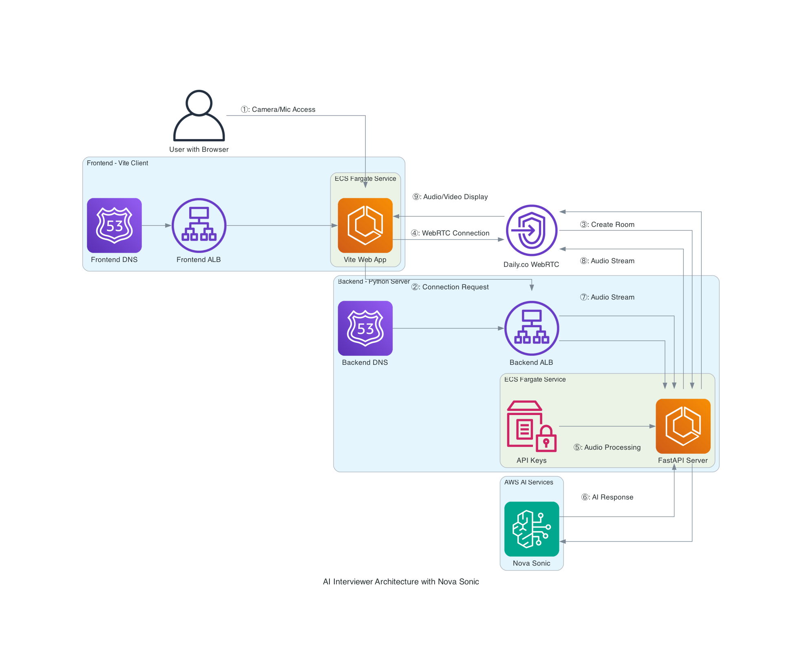

# AI Interviewer Architecture with Amazon Nova Sonic

## System Overview

The AI Interviewer system provides real-time voice-based interviews using AI technology. It leverages AWS services, including Amazon Nova Sonic for natural language processing and speech capabilities, along with WebRTC for real-time audio/video communication. The architecture follows a microservices approach with containerized components deployed on AWS Fargate.

## Architecture Components

### Frontend (Vite Client)
- **User Interface**: Browser-based interface for interview candidates
- **WebRTC Client**: Handles media streams (audio/video) via Daily.co integration
- **Media Processing**: Manages local camera/microphone access and displays interviewer

### Backend (Python Server)
- **FastAPI Server**: Coordinates interview sessions and manages connections
- **Agentic Services**: Orchestrates the interview process with structured pipelines
- **Transcript Handler**: Processes and stores conversation transcripts

### External Services
- **Daily.co**: WebRTC service for real-time audio/video streaming
- **Amazon Nova Sonic**: Provides speech-to-text, natural language understanding, and text-to-speech capabilities

### AWS Infrastructure
- **ECS Fargate**: Hosts containerized frontend and backend services
- **Application Load Balancers**: Route traffic to appropriate services
- **Route 53**: DNS management for service endpoints
- **Parameter Store**: Securely stores API keys and credentials

## Data Flow Annotations

### ① Camera/Microphone Access
- **Description**: User grants browser permission to access camera and microphone
- **Technical Details**: 
  - Uses navigator.mediaDevices.getUserMedia() API
  - Video stream displayed in local video element
  - Managed by VideoManager.js component

### ② Connection Request
- **Description**: Frontend requests connection credentials from backend
- **Technical Details**:
  - HTTP POST to `/connect` endpoint
  - Request includes any user identification information
  - Response contains Daily.co room URL and token

### ③ Create Room
- **Description**: Backend creates a WebRTC room on Daily.co
- **Technical Details**:
  - Uses Daily.co REST API to create room
  - Configures room properties (recording, geo-location)
  - Generates access token with appropriate permissions
  - Launches bot process with room credentials

### ④ WebRTC Connection
- **Description**: Frontend establishes WebRTC connection to Daily.co
- **Technical Details**:
  - Uses DailyTransport from @pipecat-ai/daily-transport
  - Initializes connection with room URL and token
  - Establishes audio/video peer connection

### ⑤ Audio Processing
- **Description**: Backend sends user audio to Amazon Nova Sonic
- **Technical Details**:
  - Audio received via WebRTC is forwarded to Nova Sonic
  - Uses AWSNovaSonicLLMService integration
  - Streams audio in real-time for processing
  - Includes context for conversation continuity

### ⑥ AI Response
- **Description**: Nova Sonic returns AI-generated response
- **Technical Details**:
  - Provides text response based on conversation context
  - Synthesizes speech with selected voice
  - May include function call results from tools
  - Maintains conversation state

### ⑦ Audio Stream (User to System)
- **Description**: User's audio streamed to backend via Daily.co
- **Technical Details**:
  - WebRTC audio stream from browser
  - Voice Activity Detection determines when user is speaking
  - Audio packets forwarded to backend pipeline

### ⑧ Audio Stream (System to Daily)
- **Description**: AI-generated speech streamed from backend to Daily.co
- **Technical Details**:
  - Speech synthesized by Nova Sonic
  - Audio stream sent through WebRTC connection
  - Pipeline manages turn-taking with user

### ⑨ Audio/Video Display
- **Description**: Audio/video rendered in user's browser
- **Technical Details**:
  - Audio played through HTMLAudioElement
  - Visual feedback shown through animation
  - Transcripts may be displayed in UI

## Deployment Architecture

The system is deployed on AWS using CDK (Cloud Development Kit) with the following components:

1. **VPC with public/private subnets** in multiple availability zones
2. **ECS Cluster** running Fargate tasks for both frontend and backend
3. **Application Load Balancers** with health checks and TLS termination
4. **Route 53** for DNS management with custom domain names
5. **Parameter Store** for secure credential management

The deployment separates frontend and backend into distinct services with their own load balancers, security groups, and scaling policies. This provides better security isolation and independent scaling capabilities.

## Security Considerations

- **HTTPS** enforced for all communications
- **API Keys** stored in Parameter Store and injected as environment variables
- **CORS** configured to restrict cross-origin requests
- **Daily.co tokens** for authenticated WebRTC connections

## Scaling and Performance

- **Fargate** allows for automatic scaling based on demand
- **Container sizing** optimized for workload (more CPU/memory for backend)
- **Audio latency** minimized through optimized media handling
- **Regional deployment** possible through CDK stack configuration