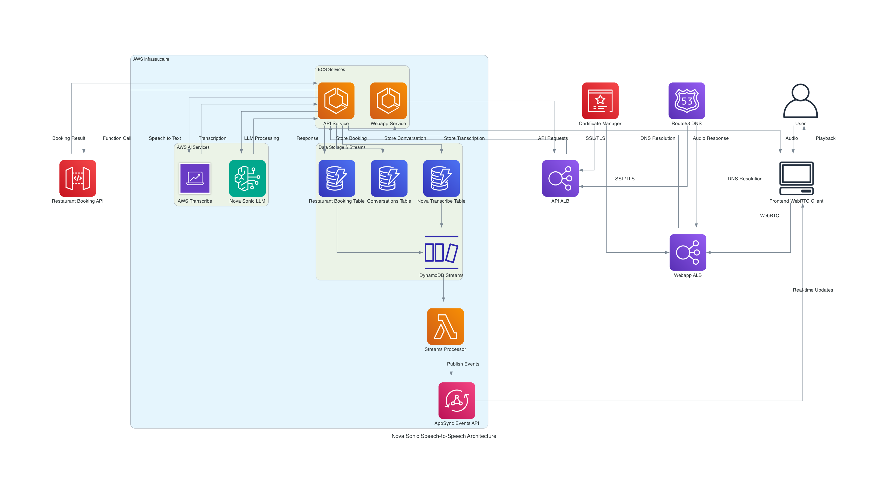

# Nova Sonic: Speech-to-Speech with Amazon Bedrock

Nova Sonic is a speech-to-speech conversation application powered by Amazon Bedrock and Amazon Nova Sonic. It enables real-time voice conversations with an AI assistant, featuring WebRTC for audio streaming and a restaurant booking capability.

## Key Features

- **Real-time Speech-to-Speech Conversations**: Engage in natural voice conversations with an AI assistant powered by Amazon Bedrock
- **WebRTC Integration**: Low-latency audio streaming for responsive interactions
- **Restaurant Booking Capability**: Demonstrate practical use cases with a restaurant booking feature
- **Real-time Event System**: AppSync Events API for real-time updates and notifications
- **Scalable Architecture**: Deployed on AWS with auto-scaling capabilities
- **Multiple Deployment Options**: Support for both ECS and EC2-based deployments

## Architecture Overview



The Nova Sonic application consists of several key components:

- **Frontend Web Application**: WebRTC-enabled interface for user interactions
- **Backend API Service**: Processes audio streams and manages conversations
- **Amazon Bedrock Integration**: Powers the AI conversation capabilities
- **DynamoDB**: Stores conversation history and restaurant bookings
- **AppSync Events API**: Provides real-time publish/subscribe functionality

For a detailed explanation of the architecture, see [ARCHITECTURE.md](ARCHITECTURE.md).

## Quick Start

### Prerequisites

- AWS Account with access to Amazon Bedrock
- AWS CLI configured with appropriate credentials
- Node.js 14.x or later
- AWS CDK v2 installed
- Docker for building container images

### Deployment

1. Clone the repository:
   ```bash
   git clone https://github.com/yourusername/speech-to-speech-amazon-nova-sonic.git
   cd speech-to-speech-amazon-nova-sonic
   ```

2. Configure environment variables:
   ```bash
   cd nova-sonic/api
   cp .env.example .env
   # Edit .env with your settings
   ```

3. Deploy the CDK stacks:
   ```bash
   cd ../../cdk
   npm install
   cdk bootstrap
   cdk deploy --all
   ```

For detailed deployment instructions, see [DEPLOYMENT.md](DEPLOYMENT.md).

## Documentation

- [Architecture Documentation](ARCHITECTURE.md): Comprehensive documentation of the system architecture
- [Deployment Guide](DEPLOYMENT.md): Detailed instructions for deploying the system
- [EC2 API Deployment](cdk/EC2_API_DEPLOYMENT.md): Alternative deployment option using EC2 instances
- [HTTPS Setup](cdk/HTTPS_SETUP.md): Instructions for configuring HTTPS
- [AppSync Events API](cdk/README-APPSYNC-EVENTS.md): Documentation for the real-time event system

## License

This project is licensed under the MIT License - see the LICENSE file for details.